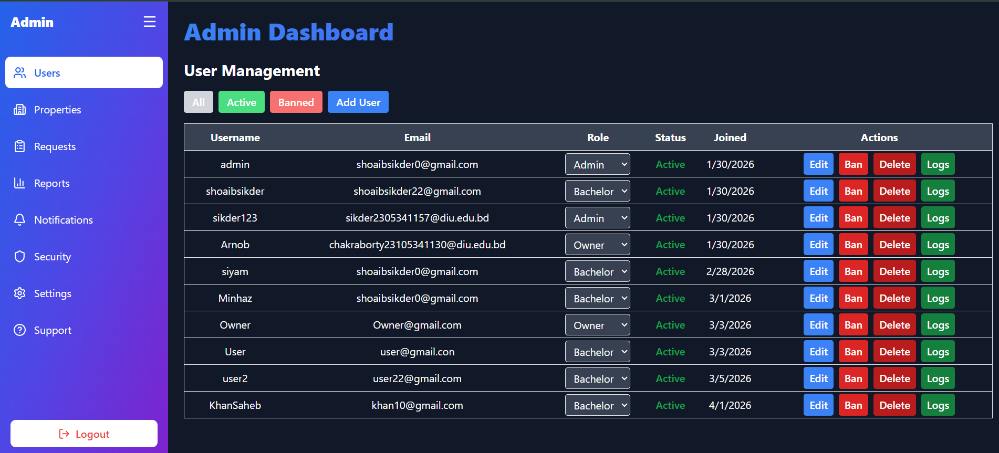
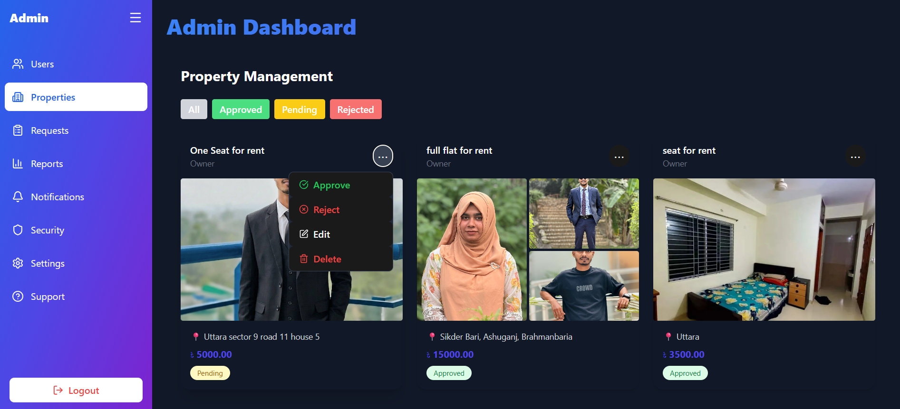
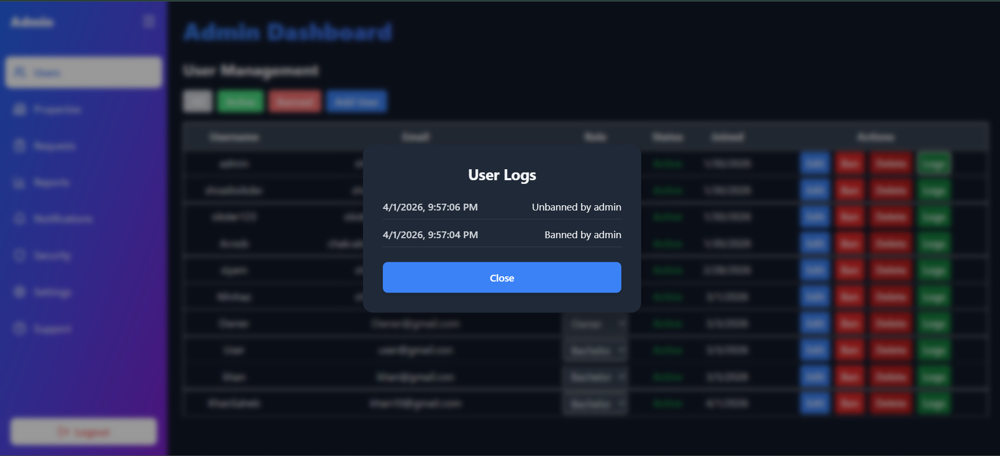
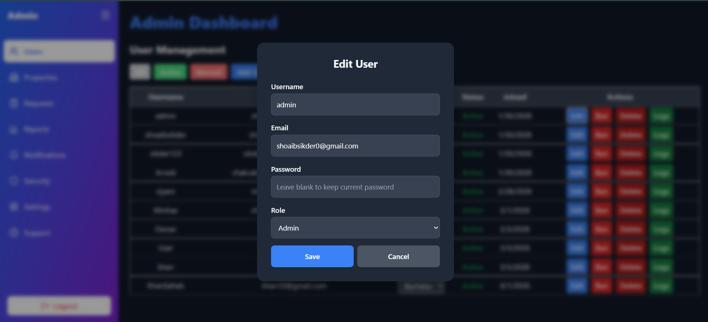
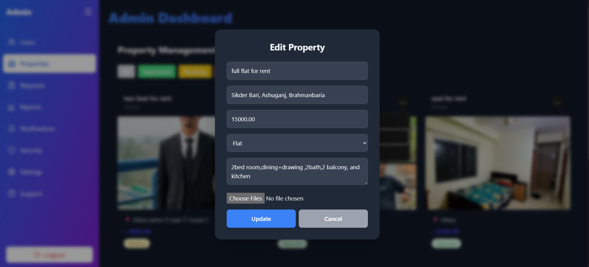

# 🏠 BachelorsNest

[](https://opensource.org/licenses/MIT)
[](https://reactjs.org/)
[](https://www.djangoproject.com/)

**BachelorsNest** is a full-stack **Flat Rental System for Bachelors**, connecting property owners with tenants through a modern web platform. Built with **Django (Backend)** and **React + Tailwind CSS (Frontend)**, it provides seamless property browsing, rent requests, and real-time communication.

---

## 📸 Screenshots

### 🔑 Login & Registration
<div style="display: grid; grid-template-columns: repeat(2, 1fr); gap: 10px; justify-items: center;">
<a href="Documentations/SystemImages/Login.png" target="_blank">

</a>
<a href="Documentations/SystemImages/Registration.png" target="_blank">

</a>
</div>

### 🧑‍🎓 Bachelor Dashboard
<div style="display: grid; grid-template-columns: repeat(3, 1fr); gap: 10px; justify-items: center;">
<a href="Documentations/SystemImages/BachelorHome.png" target="_blank">

</a>
<a href="Documentations/SystemImages/MyRequest.png" target="_blank">

</a>
<a href="Documentations/SystemImages/Notifications.png" target="_blank">

</a>
</div>

### 🏠 Owner Dashboard
<div style="display: grid; grid-template-columns: repeat(3, 1fr); gap: 10px; justify-items: center;">
<a href="Documentations/SystemImages/OwnerDashboard.png" target="_blank">

</a>
<a href="Documentations/SystemImages/MyProperties.png" target="_blank">

</a>
<a href="Documentations/SystemImages/AddProperty.png" target="_blank">

</a>
<a href="Documentations/SystemImages/RentRequest.png" target="_blank">

</a>
<a href="Documentations/SystemImages/OwnerNotification.png" target="_blank">

</a>
</div>

### 🛠️ Admin Dashboard
<div style="display: grid; grid-template-columns: repeat(3, 1fr); gap: 10px; justify-items: center;">
  <a href="Documentations/SystemImages/AdminUsers.png" target="_blank">
    
  </a>
  <a href="Documentations/SystemImages/AdminProperties.png" target="_blank">
    
  </a>
  <a href="Documentations/SystemImages/AdminUserLogs.png" target="_blank">
    
  </a>
  <a href="Documentations/SystemImages/AdminEditUsers.png" target="_blank">
    
  </a>
  <a href="Documentations/SystemImages/AdminEditUsers.png" target="_blank">
    
  </a>
</div>

### 💬 Chat System
<div style="display: grid; grid-template-columns: repeat(1, 1fr); gap: 10px; justify-items: center;">
<a href="Documentations/SystemImages/Chat.png" target="_blank">

</a>
</div>

---

## 🚀 Features

---

<details>
<summary>👤 Authentication & Roles</summary>

- 🔐 JWT Authentication (secure login & registration)
- 🧑‍🎓 Bachelor role
- 🏠 Owner role
- 🛠️ Admin role with full control

</details>

---

<details>
<summary>🧑‍🎓 Bachelor Features</summary>

- 📌 Browse approved properties with details & images  
- 📝 Send, track, and cancel rent requests  
- 💬 Real-time chat with property owners  
- 📊 Request status tracking (Pending / Accepted / Rejected)

</details>

---

<details>
<summary>🏠 Owner Features</summary>

- 🏡 Add, edit, and manage properties  
- 📥 View and manage rent requests  
- ✅ Accept or reject tenant requests  
- 💬 Real-time chat with tenants  

</details>

---

<details>
<summary>🛠️ Admin Features</summary>

- 🧾 Approve or reject property listings  
- 👥 Manage users and roles  
- 📊 Monitor platform activities  
- 🔧 Full system control  

</details>

---

<details>
<summary>🔔 Notifications (Planned)</summary>

- 📩 Real-time updates for rent requests  
- 💬 Message notifications  
- 📢 System alerts for important actions  

</details>

---

## ⚙️ Tech Stack

<div style="display: flex; gap: 10px; flex-wrap: wrap;">
<div style="flex: 1; min-width: 150px; padding: 10px; border: 1px solid #ddd; border-radius: 10px; text-align: center;">
<h4>Frontend</h4>
React.js, Tailwind CSS, Axios, React Router
</div>
<div style="flex: 1; min-width: 150px; padding: 10px; border: 1px solid #ddd; border-radius: 10px; text-align: center;">
<h4>Backend</h4>
Django, Django REST Framework, Django Channels, SQLite
</div>
</div>

---

## 📂 Project Structure

```text
BachelorNest/
│
├── backend/
│   ├── accounts/
│   ├── properties/
│   ├── rentals/
│   ├── backend/               # Django project folder
│   ├── messaging/
│   ├── notifications/
│   └── manage.py
│
├── frontend/
│   ├── src/
│   │   ├── pages/
│   │   ├── components/
│   │   ├── layouts/
│   │   ├── api/
│   │   └── App.jsx
│
├── Documentations/            # Contains screenshots and other documentation
│   ├── SystemImages/
└── README.md
````

---

## ⚙️ Installation & Setup

---

<details>
<summary>📥 Clone Repository</summary>

| Step | Command |
|------|--------|
| Clone repo | `git clone https://github.com/ShoaibSikder/BachelorsNest.git` |
| Go to project | `cd BachelorsNest` |

</details>

---

<details>
<summary>🛠️ Backend Setup (Django)</summary>

### ⚡ Environment Setup

| Step | Command |
|------|--------|
| Go to backend | `cd backend` |
| Create virtual env | `python -m venv venv` |
| Activate (Windows) | `venv\Scripts\activate` |
| Activate (Linux/macOS) | `source venv/bin/activate` |

---

### 📦 Install & Configure

| Step | Command |
|------|--------|
| Install dependencies | `pip install -r requirements.txt` |
| Make migrations | `python manage.py makemigrations` |
| Apply migrations | `python manage.py migrate` |
| Create superuser | `python manage.py createsuperuser` |

---

### ▶️ Run Server

| Step | Command |
|------|--------|
| Start server | `python manage.py runserver` |

---

### ⚡ Optional (WebSocket - Daphne)

| Step | Command |
|------|--------|
| Run with Daphne | `python -m daphne backend.asgi:application` |

</details>

---

<details>
<summary>💻 Frontend Setup (React + Vite)</summary>

### 📦 Setup

| Step | Command |
|------|--------|
| Go to frontend | `cd frontend` |
| Install packages | `npm install` |

---

### ▶️ Run App

| Step | Command |
|------|--------|
| Start dev server | `npm run dev` |

- 🌐 Default URL: `http://localhost:5173`

---

### 🔑 Environment Variables

Create a `.env` file in the **frontend** directory:

```env
VITE_API_URL=http://127.0.0.1:8000/api
```

</details>

---

## 🔗 Backend APIs

<details>
<summary>🔐 Authentication</summary>

| Method | Endpoint                  | Description       |
|--------|---------------------------|-------------------|
| POST   | /api/accounts/register/   | Register user     |
| POST   | /api/token/               | Login user (JWT)  |

</details>

---

<details>
<summary>🏠 Properties</summary>

| Method | Endpoint                               | Description              |
|--------|----------------------------------------|--------------------------|
| GET    | /api/properties/approved/              | Approved properties      |
| POST   | /api/properties/add/                   | Add property             |
| POST   | /api/properties/upload-images/         | Upload property images   |
| GET    | /api/properties/owner/                 | Owner properties         |
| PATCH  | /api/properties/approve/&lt;id&gt;/    | Admin approve property   |

</details>

---

<details>
<summary>📄 Rentals</summary>

| Method | Endpoint                          | Description               |
|--------|-----------------------------------|---------------------------|
| POST   | /api/rentals/request/             | Send rent request         |
| GET    | /api/rentals/bachelor/            | Bachelor requests         |
| GET    | /api/rentals/owner/               | Owner requests            |
| PATCH  | /api/rentals/update/&lt;id&gt;/   | Update request status     |

</details>

---

<details>
<summary>💬 Chat & Notifications</summary>

| Method | Endpoint                              | Description                     |
|--------|---------------------------------------|---------------------------------|
| POST   | /api/messages/send/                   | Send message                    |
| GET    | /api/messages/conversation/           | Get conversation                |
| GET    | /api/messages/unread-count/           | Unread message count            |
| GET    | /api/notifications/                   | Get notifications               |
| PATCH  | /api/notifications/read/              | Mark notifications as read      |

</details>

---

## 🧪 Future Improvements

<details>
<summary>🚀 Planned Features</summary>

- 💳 **Integrated Payments**  
  Direct rent and booking fee processing via SSLCommerz or Stripe.

- 📄 **Legal Automation**  
  Digital rental agreements and e-contract generation.

- 🗺️ **Map-Based Search**  
  Google Maps API integration for accurate property discovery.

- 🤖 **AI Recommendations**  
  Smart suggestions based on user behavior and preferences.

- 🏡 **Virtual Tours**  
  360° property viewing support.

- 🔐 **Identity Verification**  
  National database/API integration for trust and security.

</details>

---

## 👨‍💻 Authors & Contributors

<details>
<summary>👥 Team Members</summary>

| Name              | GitHub                                                         |
|-------------------|----------------------------------------------------------------|
| Shoaib Sikder     | [@shoaibsikder](https://github.com/shoaibsikder)               |
| Arnob Chakraborty | [@arnobchakraborty102](https://github.com/arnobchakraborty102) |
| Sharmin1219       | [@Sharmin1219](https://github.com/Sharmin1219)                 |

</details>

---

## ⭐ How to Contribute

```bash
1. Fork the project
2. Create a feature branch
3. Commit your changes
4. Push to the branch
5. Open a Pull Request
```

---

## 📜 License

MIT License

---

## 🌟 Support

If you find this project useful, please give it a ⭐ on GitHub!
