# 🏠 BachelorNest

[](https://opensource.org/licenses/MIT)
[](https://reactjs.org/)
[](https://www.djangoproject.com/)

**BachelorNest** is a full-stack **Flat Rental System for Bachelors**, connecting property owners with tenants through a modern web platform. Built with **Django (Backend)** and **React + Tailwind CSS (Frontend)**, it provides seamless property browsing, rent requests, and real-time communication.

---

## 🚀 Features

### 👤 Authentication & Roles

<div style="display: flex; gap: 10px; flex-wrap: wrap;">
<div style="flex: 1; min-width: 200px; padding: 10px; border: 1px solid #ddd; border-radius: 10px; transition: transform 0.2s;" onmouseover="this.style.transform='scale(1.05)'" onmouseout="this.style.transform='scale(1)'">
<h4>JWT Authentication</h4>
<p>Secure login and registration using JWT tokens.</p>
</div>
<div style="flex: 1; min-width: 200px; padding: 10px; border: 1px solid #ddd; border-radius: 10px; transition: transform 0.2s;" onmouseover="this.style.transform='scale(1.05)'" onmouseout="this.style.transform='scale(1)'">
<h4>Role-Based Access</h4>
<ul>
<li>🧑‍🎓 Bachelor</li>
<li>🏠 Owner</li>
<li>🛠️ Admin</li>
</ul>
</div>
</div>

---

### 🧑‍🎓 Bachelor Features

<div style="display: flex; gap: 10px; flex-wrap: wrap;">
<div style="flex: 1; min-width: 200px; padding: 10px; border: 1px solid #ddd; border-radius: 10px; transition: transform 0.2s;" onmouseover="this.style.transform='scale(1.05)'" onmouseout="this.style.transform='scale(1)'">
<h4>Browse Properties</h4>
<p>View approved properties with detailed descriptions & image grids.</p>
</div>
<div style="flex: 1; min-width: 200px; padding: 10px; border: 1px solid #ddd; border-radius: 10px; transition: transform 0.2s;" onmouseover="this.style.transform='scale(1.05)'" onmouseout="this.style.transform='scale(1)'">
<h4>Rent Requests</h4>
<p>Send, track, and cancel requests. Status: Pending / Accepted / Rejected.</p>
</div>
<div style="flex: 1; min-width: 200px; padding: 10px; border: 1px solid #ddd; border-radius: 10px; transition: transform 0.2s;" onmouseover="this.style.transform='scale(1.05)'" onmouseout="this.style.transform='scale(1)'">
<h4>Chat</h4>
<p>Real-time messaging with property owners for faster communication.</p>
</div>
</div>

---

### 🏠 Owner Features

<div style="display: flex; gap: 10px; flex-wrap: wrap;">
<div style="flex: 1; min-width: 200px; padding: 10px; border: 1px solid #ddd; border-radius: 10px; transition: transform 0.2s;" onmouseover="this.style.transform='scale(1.05)'" onmouseout="this.style.transform='scale(1)'">
<h4>Property Management</h4>
<p>Add, edit, delete, and view all properties.</p>
</div>
<div style="flex: 1; min-width: 200px; padding: 10px; border: 1px solid #ddd; border-radius: 10px; transition: transform 0.2s;" onmouseover="this.style.transform='scale(1.05)'" onmouseout="this.style.transform='scale(1)'">
<h4>Rent Requests</h4>
<p>Accept or reject tenant requests directly from the dashboard.</p>
</div>
<div style="flex: 1; min-width: 200px; padding: 10px; border: 1px solid #ddd; border-radius: 10px; transition: transform 0.2s;" onmouseover="this.style.transform='scale(1.05)'" onmouseout="this.style.transform='scale(1)'">
<h4>Chat</h4>
<p>One-to-one messaging with interested tenants in real-time.</p>
</div>
</div>

---

### 💬 Chat System

<div style="display: grid; grid-template-columns: repeat(2, 1fr); gap: 10px;">


</div>

---

### 🔔 Notifications (Planned)

* Real-time notifications for request status changes and new messages.

---

## ⚙️ Tech Stack

<div style="display: flex; gap: 10px; flex-wrap: wrap;">
<div style="flex: 1; min-width: 150px; padding: 10px; border: 1px solid #ddd; border-radius: 10px; text-align: center;">
<h4>Frontend</h4>
React.js, Tailwind CSS, Axios, React Router
</div>
<div style="flex: 1; min-width: 150px; padding: 10px; border: 1px solid #ddd; border-radius: 10px; text-align: center;">
<h4>Backend</h4>
Django, Django REST Framework, Django Channels, SQLite
</div>
</div>

---

📸 Screenshots
🔑 Login & Registration
<div style="display: grid; grid-template-columns: repeat(2, 1fr); gap: 10px;"> 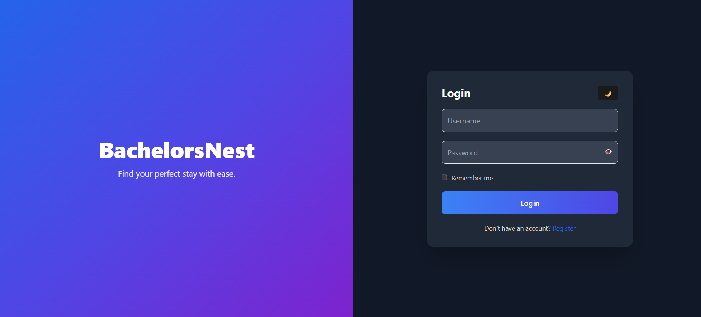 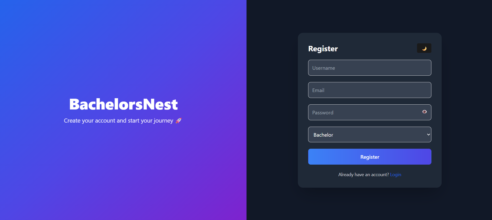 </div>
🧑‍🎓 Bachelor Dashboard
<div style="display: grid; grid-template-columns: repeat(3, 1fr); gap: 10px;"> 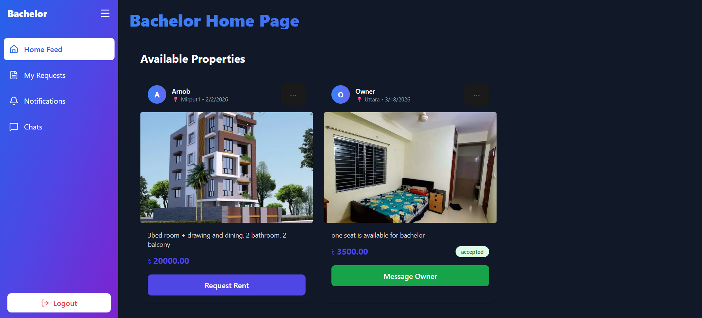 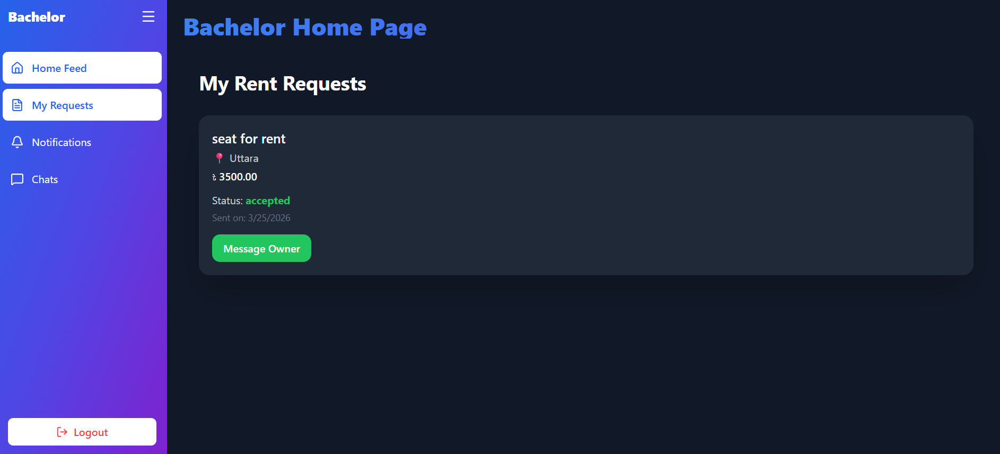 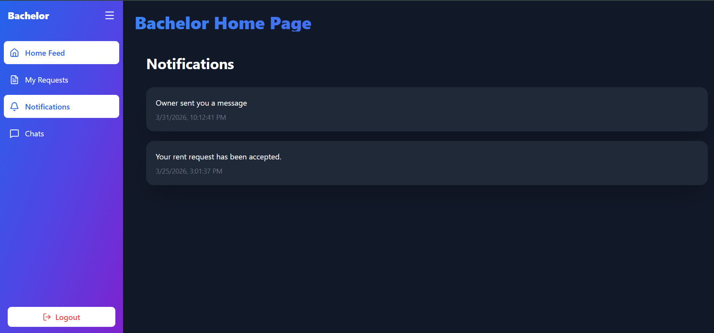 </div>
🏠 Owner Dashboard
<div style="display: grid; grid-template-columns: repeat(3, 1fr); gap: 10px;"> 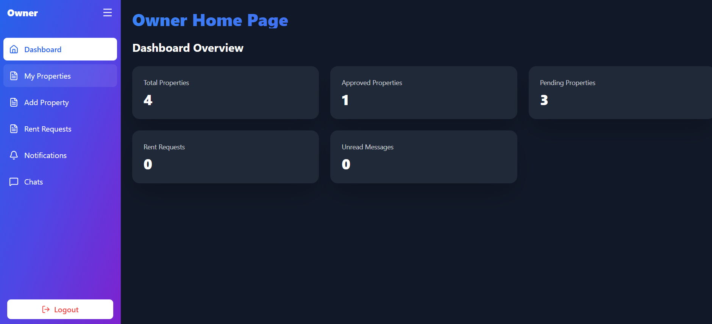 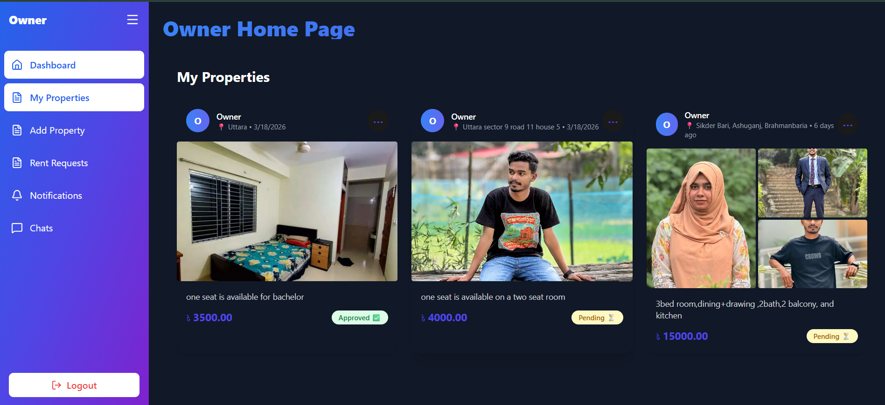 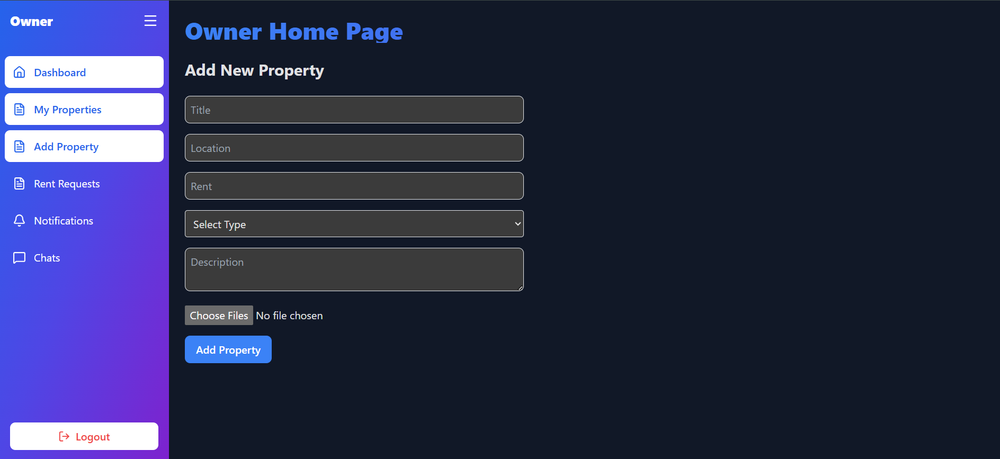 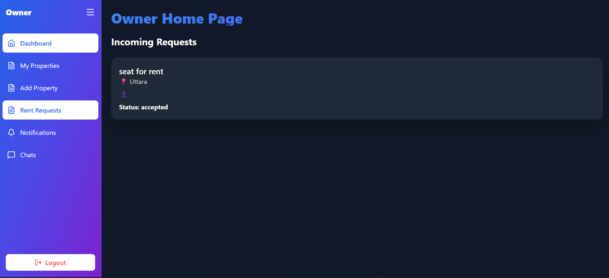 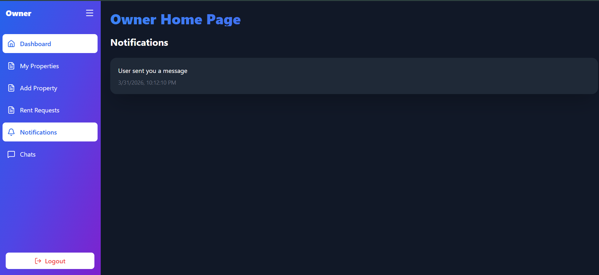 </div>
💬 Chat System
<div style="display: grid; grid-template-columns: repeat(1, 1fr); gap: 10px;"> 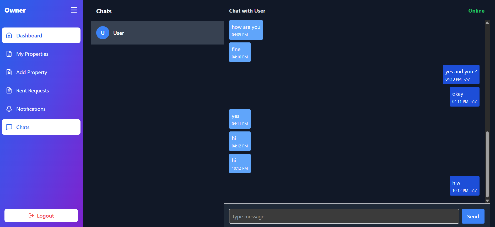 </div>

---

## ⚙️ Installation & Setup

<details>
<summary>Clone Repository</summary>

```bash
git clone https://github.com/ShoaibSikder/BachelorNest.git
cd BachelorNest
```

</details>

<details>
<summary>Backend Setup (Django)</summary>

```bash
cd backend
python -m venv venv
venv\Scripts\activate  # Windows
source venv/bin/activate  # macOS/Linux
pip install -r requirements.txt

# Migrations
python manage.py makemigrations
python manage.py migrate

# Create superuser
python manage.py createsuperuser

# Run server
python manage.py runserver

# Optional: Use Daphne for WebSockets
python -m daphne backend.asgi:application
```

</details>

<details>
<summary>Frontend Setup (React)</summary>

```bash
cd frontend
npm install
npm run dev
```

* Default URL: `http://localhost:5173`
* .env Example:

```env
VITE_API_URL=http://127.0.0.1:8000/api
```

</details>

---

## 🔗 Backend APIs (Collapsible)

<details>
<summary>Authentication</summary>
- `POST /api/accounts/register/` – Register user  
- `POST /api/token/` – Login user (JWT)  
</details>

<details>
<summary>Properties</summary>
- `GET /api/properties/approved/` – Approved properties  
- `POST /api/properties/add/` – Add property  
- `POST /api/properties/upload-images/` – Upload property images  
- `GET /api/properties/owner/` – Owner properties  
- `PATCH /api/properties/approve/<id>/` – Admin approve property  
</details>

<details>
<summary>Rentals</summary>
- `POST /api/rentals/request/` – Send rent request  
- `GET /api/rentals/bachelor/` – Bachelor requests  
- `GET /api/rentals/owner/` – Owner requests  
- `PATCH /api/rentals/update/<id>/` – Update request status  
</details>

<details>
<summary>Chat & Notifications</summary>
- `POST /api/messages/send/` – Send message  
- `GET /api/messages/conversation/` – Get conversation  
- `GET /api/messages/unread-count/` – Unread message count  
- `GET /api/notifications/` – Get notifications  
- `PATCH /api/notifications/read/` – Mark notifications read  
</details>

---

## 🧪 Future Improvements

* Real-time notifications 🔔
* Mobile responsiveness improvements 📱
* Smart property recommendations 🧠
* Property reviews & ratings ⭐
* Admin analytics dashboard 📊

---

## 👨‍💻 Authors & Contributors

| Name              | GitHub                                                         |
| ----------------- | -------------------------------------------------------------- |
| Shoaib Sikder     | [@shoaibsikder](https://github.com/shoaibsikder)               |
| Arnob Chakraborty | [@arnobchakraborty102](https://github.com/arnobchakraborty102) |
| Sharmin1219       | [@Sharmin1219](https://github.com/Sharmin1219)                 |

---

## ⭐ How to Contribute

```bash
1. Fork the project
2. Create a feature branch
3. Commit your changes
4. Push to the branch
5. Open a Pull Request
```

---

## 📜 License

MIT License

---

## 🌟 Support

If you find this project useful, please give it a ⭐ on GitHub!

---
